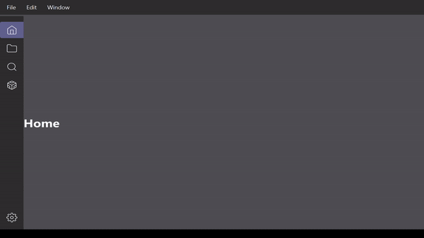

# pythonIDE-with-AI
Using pytorch to autocomplete code by using a trained database. 

- Goal: The goal of this project is to integrate pytorch with an IDE for code completion and suggestions for python. 
>- *TBD: Integrated AI chatbot assistant*
- Technology Used: Pytorch and PyQt6 to build the AI and the UI for the IDE

See the wireframe concepts --> [Wireframes](https://github.com/HalfasleepDev/pythonIDE-with-AI/blob/7ce4595ba00243e48483e5283fa009e68dde5a0b/Concepts/Wireframes/README.md)

## Dev blog & updates
Blog and dev updates to the project. I will add to this as the deadline of the project approaches closer. The final project is due on the 16th of June. If all goes well the first release of this project will be around the 13th or 15th. This release will be for windows and hopefully optimized or working without major bugs.

### 05-30-2023 

So far throughout the development, some features shown in the wireframes have been cut such as,
- Code optimization
- Editor minimap
- Resizable windows
- Searching features

The elements that have been implemented so far,
- [x] Editor
- [x] File tree view
- [x] Search
- [x] Ai assistant
- [x] Terminal integration

#### A demo of the overall function:

Next step is to implement autocorrect and autodoc functions using codet5, and a performance monitor by the end of this week. 

Final touches such as, theming, minimized side menus, settings, and an ai task viewer will be completed later on in the project. 
